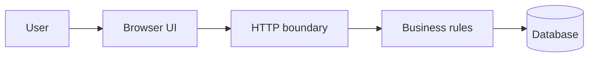

# Architecture map
One diagram should explain one question. Replace the example labels with real components.

| Module | Responsibility | Public interface | May depend on | Failure behavior |
|---|---|---|---|---|

Data entities, constraints and ownership:
External services and trust boundaries:
One request / failure path:
Capacity, latency and operating cost assumptions:
Backup/restore and rollback:
